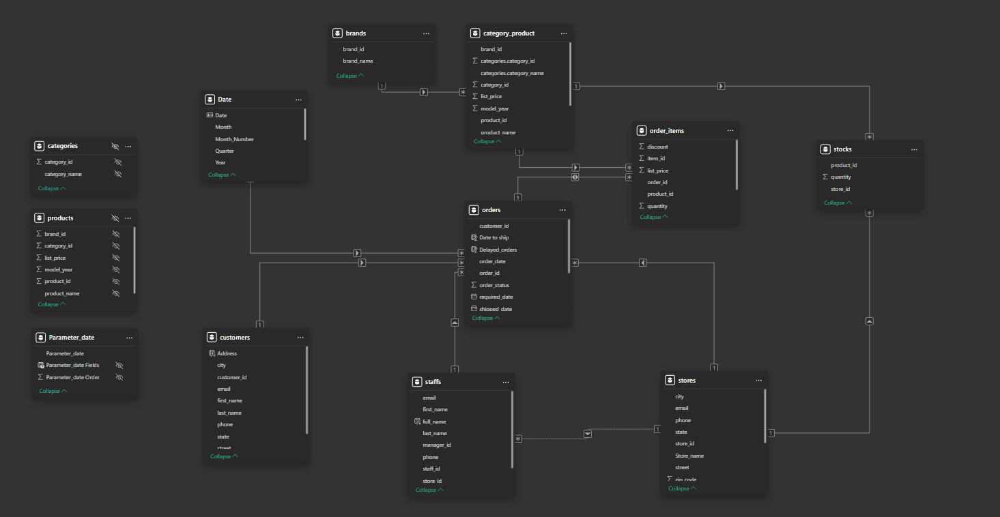
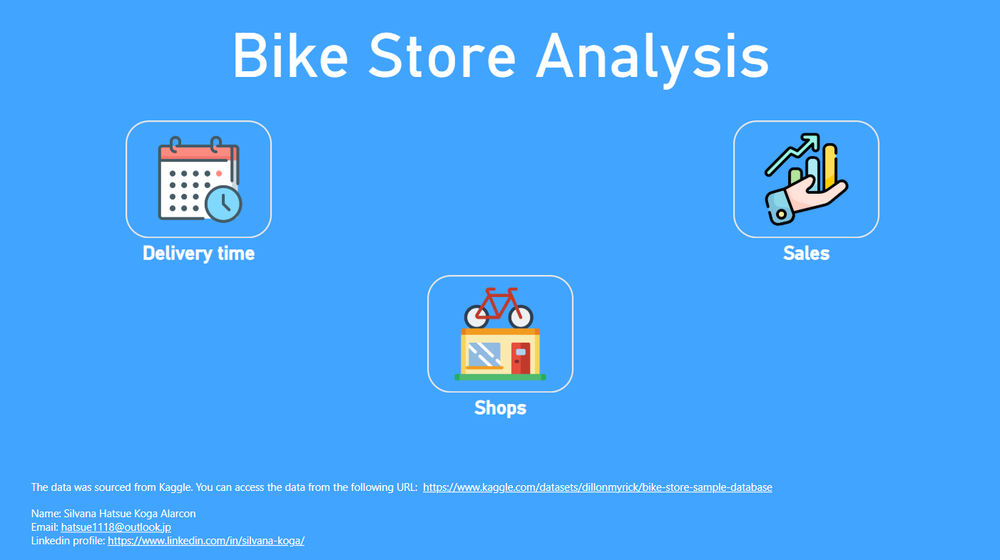
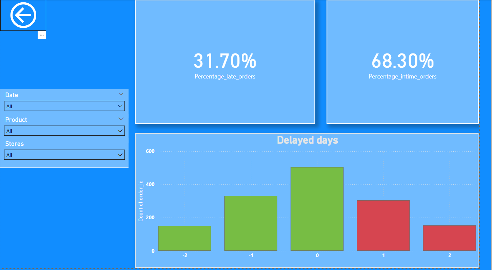
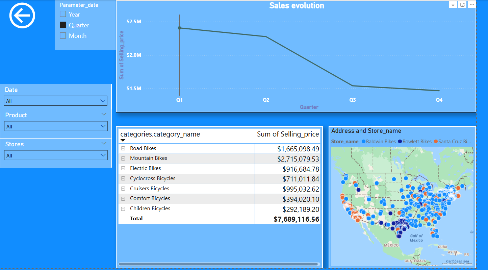
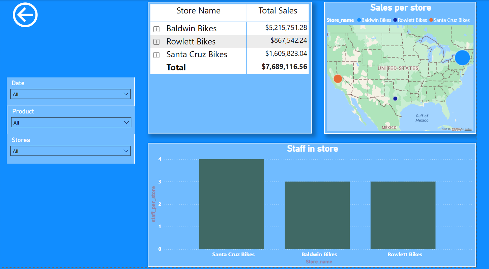

# Power BI - Rental Bikes
To test my Power Bi knowledge I created a report using the data from:
https://www.kaggle.com/datasets/dillonmyrick/bike-store-sample-database

In this report I tried to add:
- Navigation Buttons
- KPIs in Card Visuals
- Matrix Visuals
- Conditional Formatting
- Maps with Geolocation
- Hierarchies
- Field Parameters
- DAX Measures
- Power Query Transformations
- Joins of tables

## Semantic Model

To begin with, I created a merged table combining Categories and Products using Power Query to reduce the number of columns and simplify the data model. I also removed unnecessary columns to enhance performance.

In the semantic model image, the Orders table serves as the central fact table, surrounded by several related dimension tables. I established new relationships between these tables to enable effective filtering and interactivity across visuals. For example, I linked the fact table to the Date table to generate calculated columns such as "Late Orders," which are then displayed in the report visuals.

All calculated tables (like the Date table), columns, and measures were created using DAX (Data Analysis Expressions).

---

## Report 
The title page features navigation buttons that allow users to jump directly to specific report pages. The report contains three main analysis sections: Delivery Time, Shops, and Sales Performance.

### Delivery time page
This page includes two card visuals that display the percentage of on-time and late deliveries. Below the cards, a column chart illustrates delivery performance — from orders that arrived two days early to those delivered two days late.

Thanks to conditional formatting, early deliveries are highlighted in green, while late deliveries are shown in red for quick interpretation.

### Sales page
This page features line charts, a matrix visual, and a map visual, all of which can be filtered using slicers.

- The line chart shows the evolution of sales over time, which users can filter by year, quarter, or month.

- The matrix visual displays detailed sales data by category and item.

- The map visual reveals customer locations and the stores where purchases were made.

### Shops page
This page allows users to analyze shop-related metrics in depth.

- A matrix visual shows total sales per shop and lists the employees working in each store.

- The Staff in Store visual provides an overview of staff distribution.

- Finally, the map visual enables easy comparison of sales performance between shops based on their geographical location.

